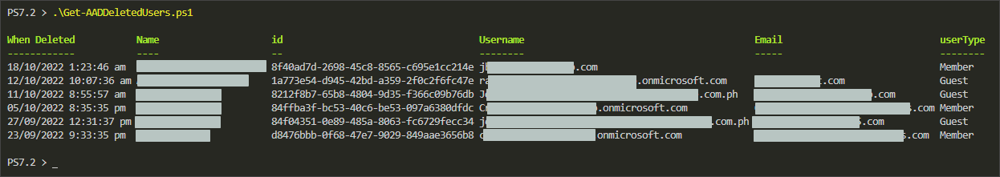
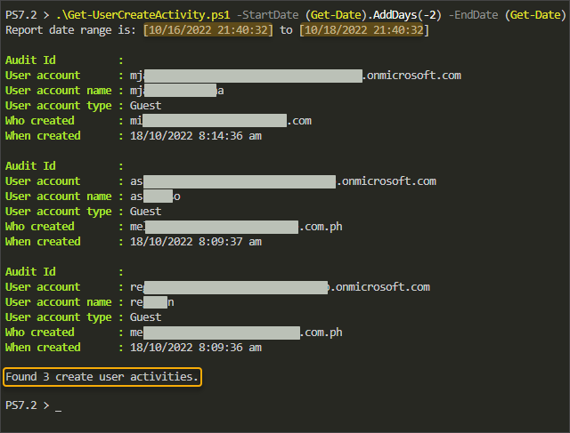
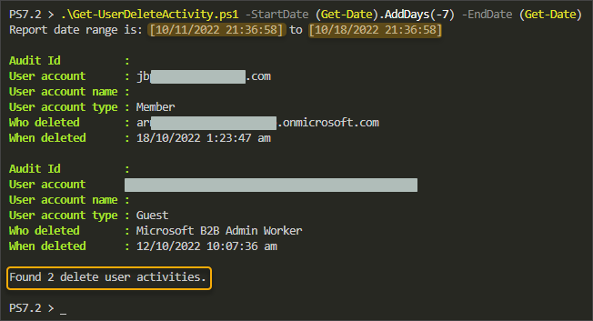

# PowerShellGraphAdhocReports

 PowerShell Graph customized report wrapper scripts

## Requirements <!-- omit in toc -->

* [Microsoft Graph PowerShell SDK module](https://learn.microsoft.com/en-us/powershell/microsoftgraph/installation)
* Windows PowerShell 5.1 or [PowerShell Core (7.2+) on Windows or Linux](https://learn.microsoft.com/en-us/powershell/scripting/install/installing-powershell)

## Scripts List  <!-- omit in toc -->

<!-- markdownlint-disable MD004 -->
- [Get-AADDeletedUsers.ps1](#get-aaddeletedusersps1)
- [Get-UserCreateActivity.ps1](#get-usercreateactivityps1)
- [Get-UserDeleteActivity.ps1](#get-userdeleteactivityps1)

## Get-AADDeletedUsers.ps1

Get all soft-deleted users that still exist in the AAD Deleted Users.

```PowerShell
.\Get-AADDeletedUsers.ps1
```



## Get-UserCreateActivity.ps1

Get all users created within the specified date range.

```PowerShell
# Example: Get created users in the last 2 days
.\Get-UserCreateActivity.ps1 -StartDate (Get-Date).AddDays(-2) -EndDate (Get-Date)
```



## Get-UserDeleteActivity.ps1

Get all users deleted within the specified date range.

```PowerShell
# Example: Get deleted users in the last 7 days
.\Get-UserDeleteActivity.ps1 -StartDate (Get-Date).AddDays(-7) -EndDate (Get-Date)
```


